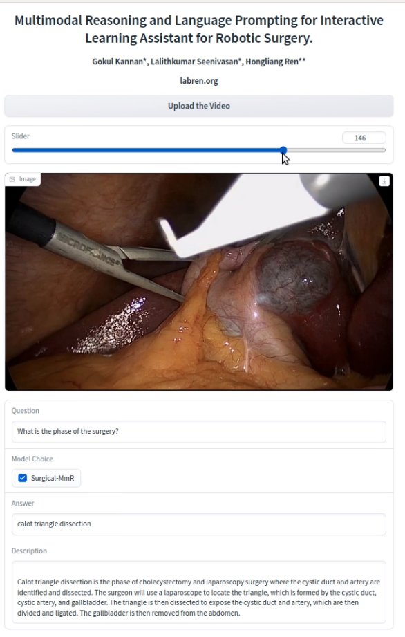

<div align="center">

<samp>

<h1> Interactive Learning Assistant for Robotic Surgery. </h1>

<h3> Lalithkumar Seenivasan*, Gokul Kannan*, Chwee Ming Lim, Hongliang Ren** </h3>

</samp>  

</div>     
    
<!-- # ILARS - Multimodal Reasoning and Language Prompting for Interactive Learning Assistant for Robotic Surgery. -->
## Setup
### Basic setup
```bash
git clone https://github.com/g0kul6/ILARS.git
cd ILARS/
mkdir checkpoints
touch api.txt
conda env create -f env.yml 
```
* Place your openai-api key in api.txt.  
### Download sample videos
* Sample Video 1 Link : 
* Sample Video 2 Link :
### Download models
* Model Link :
* Place your downloaded model in the checkpoints folder.
### Host app 
```bash
python app.py
```
## ILARS UI
